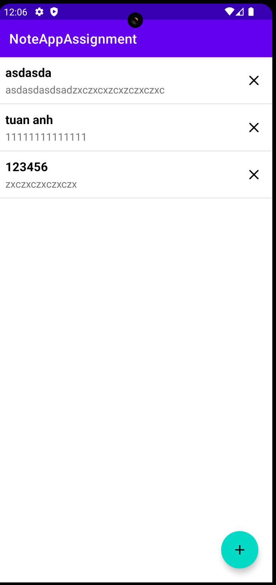
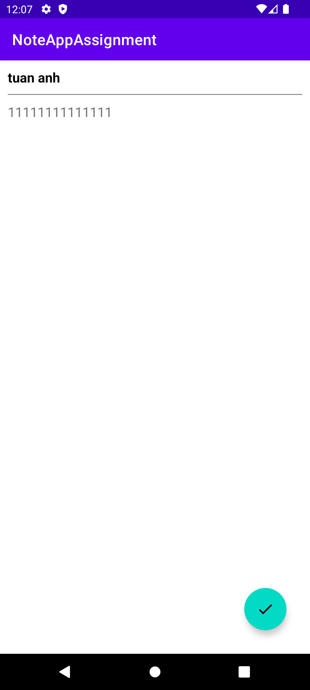
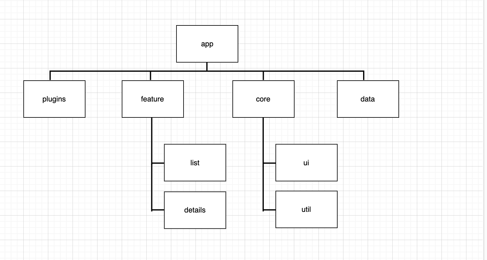

# Note Assignment

The architecture of the application is based, apply and strictly complies with each of the following 5 points

1. **A single-activity/ feature-activity architecture**: using the [Navigation component](https://developer.android.com/guide/navigation/navigation-getting-started) to manage fragment operations.
2. **[Android architecture components]**: (https://developer.android.com/topic/libraries/architecture/), part of Android Jetpack for give to project a robust design, testable and maintainable.
3. **Pattern [Model-View-ViewModel]**: (https://en.wikipedia.org/wiki/Model%E2%80%93view%E2%80%93viewmodel) (MVVM) facilitating a[separation](https://en.wikipedia.org/wiki/Separation_of_concerns) of development of the graphical user interface.
4. **[S.O.L.I.D]**:(https://en.wikipedia.org/wiki/SOLID) design principles intended to make software designs more understandable, flexible and maintainable.
5. **[Modular app architecture]**: (https://proandroiddev.com/build-a-modular-android-app-architecture-25342d99de82) allows to be developed features in isolation, independently from other features.

## Tech-task
-   [Android KTX](https://developer.android.com/kotlin/ktx.html) → provide concise, idiomatic Kotlin to Jetpack and Android platform APIs.
-   [AndroidX](https://developer.android.com/jetpack/androidx) → major improvement to the original Android [Support Library](https://developer.android.com/topic/libraries/support-library/index), which is no longer maintained.
-   [Data Binding](https://developer.android.com/topic/libraries/data-binding/) → allows you to bind UI components in your layouts to data sources in your app using a declarative format rather than programmatically.
-   [Lifecycle](https://developer.android.com/topic/libraries/architecture/lifecycle) → perform actions in response to a change in the lifecycle status of another component, such as activities and fragments.
-   [LiveData](https://developer.android.com/topic/libraries/architecture/livedata) → lifecycle-aware, meaning it respects the lifecycle of other app components, such as activities, fragments, or services.
-   [Navigation](https://developer.android.com/guide/navigation/) →  helps you implement navigation, from simple button clicks to more complex patterns, such as app bars and the navigation drawer.
-   [Room](https://developer.android.com/topic/libraries/architecture/room) - persistence library provides an abstraction layer over SQLite to allow for more robust database access while harnessing the full power of SQLite.
-   [ViewModel](https://developer.android.com/topic/libraries/architecture/viewmodel) → designed to store and manage UI-related data in a lifecycle conscious way. The ViewModel class allows data to survive configuration changes such as screen rotations.
-   [Coroutines](https://kotlinlang.org/docs/reference/coroutines-overview.html) → managing background threads with simplified code and reducing needs for callbacks.
-   [Hilt](https://dagger.dev/) - dependency injector for replacement all FactoryFactory classes.

## Screenshots

# App architecture

## Modules Overview

The project is divided into several modules:

- `:app` - Android app module managing app modules.
- `:plugins` - plugins for managing build configurations.
- `:core:ui` - Android library include UI components such as BaseActivity, BaseFragment.....
- `:core:util` - Kotlin-only module containing utility functions (not an Android library).
- `:data` - Android library for the data layer.
- `:feature:details` - Android library for the details feature.
- `:feature:list` - Android library for the list feature.
